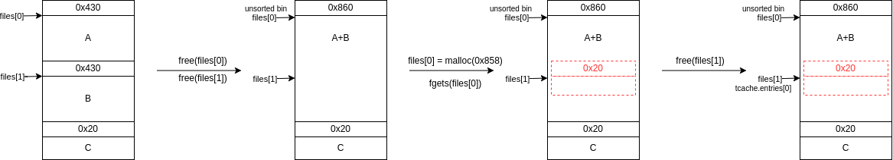

# FCSC 2024 - FILE CHECKER
- This year's least solved pwn, many thanks to the author, `XeR`, for this amazing challenge !

## Overview
```
1. prepare a file
2. clean a file
3. handle a file
4. leave
> 

```
- The program's interface is very similar to your average leakless heap pwn, with the addition of a `"handle a file"` command, which takes the filename from one of the allocated chunks, then tries to `fopen` then `fclose` the corresponding file.
- We have little freedom on the `fopen` mode a priori :
```
1. prepare a file
2. clean a file
3. handle a file
4. leave
> 3
index: 0
Mode:
1. read-only
2. read + write
3. read + write + create + append
```
- protections on the provided binary:
```
[*] '/home/skuuk/fcsc24/file-checker-src/public/file-checker'
    Arch:     amd64-64-little
    RELRO:    Full RELRO
    Stack:    Canary found
    NX:       NX enabled
    PIE:      PIE enabled
```
- protections on the provided libc:
```
[*] '/home/skuuk/fcsc24/file-checker-src/public/libc-2.39.so'
    Arch:     amd64-64-little
    RELRO:    Full RELRO
    Stack:    Canary found
    NX:       NX enabled
    PIE:      PIE enabled
```
- This the most recent libc and with full relro enabled, making heap exploitation especially difficult in this leakless context
- To make matters worse, `LD_BIND_NOW` is enabled, which forces the resolution of most symbols by the loader at the start of execution, rather than lazily

## Setup
- To ease my exploiting process, I downloaded debug symbols for the provided `libc` and `ld`, then unstripped them.
- I also downloaded the [glibc source code](https://ftp.gnu.org/gnu/glibc/) so as to be able to conveniently step through it while debugging in `gdb`

## Vulnerabilities
- As usual, I started this challenge by reviewing the provided source code, in search of vulnerabilities
- They were fairly easy to find, but rather difficult to exploit. Just the way I like challenges :D
### Double free
```C
static void clean(void)
{
	size_t index;
	if(!getIndex(&index))
		return;

	free(files[index]);
}
```
- `files` entries are not set to `NULL` after they are freed, and can be freed multiple times as a result. 
- This allows to overlap chunks quite [easily](https://github.com/5kuuk/CTF-writeups/tree/main/sekai-2023/textsender), in a fashion similar to [House of Botcake](https://github.com/shellphish/how2heap/blob/master/glibc_2.31/house_of_botcake.c),
- Overlapping chunks is an extremely powerful primitive, and can lead to [`tcache poisoning`](https://github.com/shellphish/how2heap/blob/master/glibc_2.31/tcache_poisoning.c), but usually requires a heap leak so as to bypass [safe linking](https://research.checkpoint.com/2020/safe-linking-eliminating-a-20-year-old-malloc-exploit-primitive/)
- It can also lead to a [`house of muney`]() attack, which munmaps and mmaps again read-only sections of libraries, typically `libc`, so as to overwrite them and exploit symbol resolution leaklessly

### Arbitrary `fopen` mode
```C
static bool getInt(size_t *n)
{
	return 1 == scanf("%lu", n);
}

static void handle(void)
{
	size_t index;
	if(!getIndex(&index))
		return;

	static const char *const modes[] = {
		"r",
		"r+",
		"a"
	};

	printf("Mode:\n");
	//for(size_t i = 0; i < sizeof(modes) / sizeof(*modes); i++)
	//	printf("%lu: %s\n", i, modes[i]);
	puts("1. read-only");
	puts("2. read + write");
	puts("3. read + write + create + append"); // useful for dirs

	size_t mode;
	if(!getInt(&mode))
		return;

	// Open the file with the specified mode
	FILE *fp = fopen(files[index], modes[mode - 1]);
	if(NULL == fp)
		return perror("fopen");

	if(0 != fclose(fp))
		return perror("fclose");

	puts("Permission check passed!");
}
```
- in `handle`, there is no boundary check for the index of the `modes` array. This allows for passing an arbitrary mode to `fopen`, if a `files` entry is used as a mode
- Notably, we can use the `ccs` mode, which forces the loading of a shared object as well as the resolution of some symbols on the fly
- This makes this shared object susceptible to a house of muney attack, and it is the starting point I settled on

## Overlapping chunks
- Here is a diagram I made, illustrating how one can overlap two chunks when leveraging a double free vulnerability :

*if it does not load, it is in `overlap_chunks.png`*
- We can then leverage the unsorted bin chunk to overwrite the forward pointer of the smaller fake chunk which is now linked in the `tcache`, leading to arbitrary write, however this requires bypassing [safe-linking](https://research.checkpoint.com/2020/safe-linking-eliminating-a-20-year-old-malloc-exploit-primitive/), and thus a heap leak
- While the above illustrates the concept on heap-ranged chunks, one can similarly edit the size of an already munmpapped mmmap chunk, using a bigger mmaped chunk that was mapped over it, then munmap the former again, which will munmap a number of mmaped pages below it, possibly including read-only sections of some library, that we can then remap, notably to highjack symbol resolution. This is the core idea behind the [House of Muney](https://maxwelldulin.com/BlogPost/House-of-Muney-Heap-Exploitation) attack.

## Heap Leak with `House of Muney`
 - This parts relies primarily on the `ccs` fopen mode which allows loading and resolving symbols from shared objects despite the `LD_BIND_NOW`
 - As explained [here](https://hugeh0ge.github.io/2019/11/04/), the `ccs` mode allows for custom character sets defined in the `gconv_cache`, loads the corresponding `.so` shared object, resolves and calls `gconv_init`
 - My idea here is to use [House of Muney](https://maxwelldulin.com/BlogPost/House-of-Muney-Heap-Exploitation) on the read-only first page of this `.so` so as to force the symbol resolution of `gconv_init` to some function/code snippet of interest
 - I tried multiple different character sets I found by peeking into the `gconv_cache`, and settled for `"ccs=NC_NC00-10"`, because its corresponding shared object had no newline that could not be replaced during the house of muney attack
    - this was a requirement, as all chunk content, including our remapped and patched page, is sent through `fgets` which stops processing input at the first newline
 - Symbol resolution is highjacked by replacing the `sym->st_value` of the `gconv_init` symbol entry, which will fool `do_lookup_x` (called by `__libc_dlsym`) into resolving `gconv_init` to a target code location
 - A target into `libc` gives us a lot of freedom, however this involves some light bruteforcing as the offset between our shared object and libc is not constant
    - I observed this empirically, and I guess there is hardening on the relative locations of shared libraries despite mmap relativity
    - For this reason, [I disabled ASLR](https://askubuntu.com/questions/318315/how-can-i-temporarily-disable-aslr-address-space-layout-randomization) during the development and debugging process of my exploit
 - If we could control the first argument passed to `gconv_init` or if there was a good [one_gadget](https://github.com/david942j/one_gadget), we could spawn a shell there and be done, however I did not figure out a way to achieve either
 - Instead, I decided to call `puts`, since the argument passed to `gconv_init` is a dynamically allocated struct with a first field that is also a heap pointer we can thus leak
 - The attentive reader will have realized that this requires resolving `gconv_init` twice for the same library, which should not ever happen
    - This is achieved through tricking [`__gconv_find_shlib`](https://elixir.bootlin.com/glibc/latest/source/iconv/gconv_dl.c#L66) into not finding the previously generated handle, which it searches by path to the library
    - This path is stored on the heap, and careful feng shui allows us to overlap a free chunk on it, which can then be used to overwrite the it

## Targeting the `tcache_perthread_struct` for a `libc` leak
 - As mentioned above, the double free vulnerability, combined with a heap leak, allows to bypass safe-linking and do `tcache poisoning` with targets inside the heap. Thus abritrary heap write is achieved
 - To leak libc, we will use a [FSOP](https://ret2school.github.io/post/catastrophe/) technique that targets stdout for abitrary (heap) read, leaking a libc pointer present somewhere on the heap
 - To achieve this, some fields of stdout must be overwritten, thus a chunk nearby and also above stdout (inside libc) must be allocated
 - By faking and allocating a file handle inside the tcache_perthread_struct, which is on the heap and contains the unsafely linked heads of the tcache freelists, the [`_chain`](https://elixir.bootlin.com/glibc/glibc-2.39/source/libio/genops.c#L52) field (= pointer to `stderr`) replaces whatever freelist head was there before
 - Then, allocating a chunk of the proper size will thus return `stderr`, which is right above `stdout` in `libc`, so we can use it to edit `stdout` and leak a `libc` pointer stored on the heap

## Spawning a shell after `exit`
 - With both a heap leak, libc leak as well as `tcache poisoning` abilities, arbitrary `libc` write is achieved
 - I decided to go for code execution after `exit`, targeting [`__run_exit_handlers`](https://elixir.bootlin.com/glibc/glibc-2.39/source/stdlib/exit.c#L36)
    - This function looks into the read-writable `__exit_funcs` list for functions that have to execute to clean stuff up (like `_dl_fini`) before truly exiting
    - This is an excellent target as we can not only control which function is called but also its first argument, stored alongside it
    - However, these function pointers are mangled:  the original pointer is rotated left by 17, and is also xored with a random value stored stored in the `tls`
    - I relied on the assumption that the tls was at a constant offset to the shared object we loaded in the heap leak part of the exploit, of which we bruted the offset to `libc` already
    - since we know where `libc` is, we also know where this shared object is and thus the `tls` location too
    - By overwriting an `__exit_funcs` list entry and the cookie by 0, pointer mangling is bypassed and `system("/bin/sh\0")` can be called after `exit`
 - Before this happens, `_IO_cleanup` is called, which requires a valid `vtable` pointer and `lock` for all opened file handles, including `stderr`, which was corrupted when overwriting stdout:
    - The `lock` can taken care of during the stdout overwrite by using a heap pointer to 0
    - The `vtable` pointer can be fixed using the arbitrary write capabilities

## FLAG
After about ~1h with 7 concurrent exploit runs :
```
[+] Opening connection to challenges.france-cybersecurity-challenge.fr on port 2101: Done
[*] doing muney
[CRITICAL] heap_leak: 0xb852942ea40
[CRITICAL] heap: 0xb852942cfa0
[CRITICAL] tcache: 0xb852942cfb0
[CRITICAL] link: 0xb852942fd20
[CRITICAL] alloc_sz: 0x120
[CRITICAL] bin_target: 0xb852942d0b0
[CRITICAL] libc: 0x673915200000
[CRITICAL] cookie: 0x67391552c770
/home/skuuk/fcsc24/file-checker-src/public/exploit.py:125: BytesWarning: Text is not bytes; assuming ASCII, no guarantees. See https://docs.pwntools.com/#bytes
  r.sendline(m,**kwargs)
[*] Switching to interactive mode
1. prepare a file$ ls
file-checker
flag.txt
$ cat flag.txt
FCSC{93aa742b341b591bb4a6cad5c1b9c63ba382ec6f8dd373ca82fd7c777443fe44}
```
*Note: this lengthy runtime tends to suggest an entropy of 12 rather than 8 bits on the `puts` offset, unlike I initially assumed*